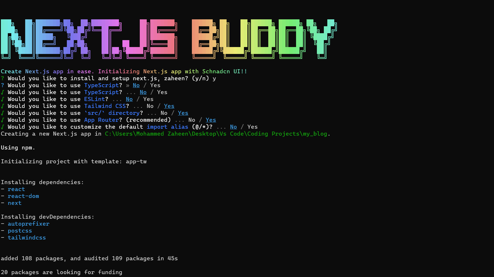

# Next-js-buddy
A command line interface (CLI) for creating Next.js app with ease. The project is initialized with latest Next.js and Shadcn UI library. stay tuned for more customization !!

[](https://www.npmjs.com/package/next-js-buddy)
[](https://github.com/yourusername/next-js-buddy/blob/main/LICENSE)

Simplify the process of creating a Next.js project with Shadcn UI library using this handy npm package.

## Features

- Quickly generate a Next.js application.
- Easily set up shadcn UI library.

## Installation

You can install `Next-js-buddy` globally using npm or yarn:

```bash
npm install -g next-js-buddy
# or
yarn global add next-js-buddy
```

# Usage
## Initializing a Next.js Project
To create a new Next.js project with Shadcn UI, run the following command:
```bash
next-js-buddy
```
This command will guide you through the project initialization process and create the necessary project structure.



# License
This project is licensed under the MIT License - see the LICENSE file for details.

# Contributing
We welcome contributions from the community. To contribute to Next-js-buddy, please follow these guidelines:

1. Fork the repository
2. Create a new branch for your feature or bug fix.
3. Make your changes.
4. Test your changes.
5. Submit a pull request to the main branch.

# Issues
If you encounter any issues with Next-js-buddy or would like to request a new feature, please open an issue on the [GitHub repository](https://github.com/MohdZaheen123/Next.js-Buddy.git).

# Author
Mohamed Zaheen

- GitHub: https://github.com/MohdZaheen123
- Website: https://znprogs-frontend.vercel.app/
- Email: mohamedzaheen986@gmail.com

# Acknowledgments
Special thanks to the creators of Next.js and Shadcn UI for their fantastic tools and libraries.

